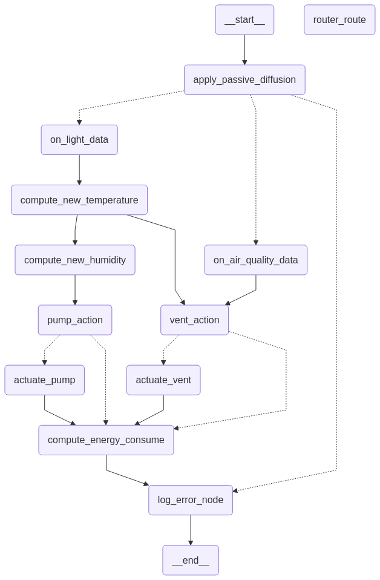

# Smart Greenhouse Simulation Project 🌱

## Introduction

This project was born from the need to build an intelligent, reactive IoT-based greenhouse management system in which sensors and actuators cooperate in real time to maintain optimal temperature, humidity, light, and air-quality conditions. Traditional greenhouse controllers rely on rigid, synchronous loops that are difficult to adapt to dynamic, distributed scenarios. **LangGraph**, an event-driven orchestration framework, replaces monolithic cycles with a modular graph of stateful nodes, dependencies, and transition rules, enabling truly parallelized and responsive control.

---

## Objectives

1. **Real-Time Responsiveness**  
    Simulated sensors update (light, CO₂) is treated as an event via MQTT. LangGraph reacts immediately, triggering only the necessary computations and actions—no wasted polling loops or fixed intervals.
    
2. **Modularity & Reuse**  
    Each greenhouse—or **zone**—is modeled as its own sub-graph of sensors and actuators. Adding a new zone, sensor type, or control rule simply means extending the graph; the core engine remains untouched.
    
3. **Inter-Zone Simulation**  
    A **passive diffusion** node propagates sensor values between neighboring zones, simulating realistic environmental exchanges (heat drift, moisture diffusion).
    
4. **Reliable Monitoring & Reporting**  
    At the end of each processing cycle, a centralized logging node collects and orders all errors and debug messages, ensuring clear, chronological output despite the asynchronous nature of the system.
    

---

## System Architecture

```
[Zone Simulation] ↔ [MQTT Broker] ↔ [LangGraph Engine] ↔ [Actuators]
```

- **Zone Simulation**
    
    - Each zone encapsulates five configurable sensors (temperature, humidity, air quality, energy consume and light sensor) and two of them regularly publishes readings on topics `greenhouse/<zone>/<sensor>/raw`.
    
    - Initial parameters (ranges, coefficients, thresholds) tailor each zone to different crop types.
    
- **MQTT Broker**
    
    - Aggregates sensor messages.
    
    - Enables LangGraph to subscribe to wild-card topics and receive events in real time.
    
- **LangGraph Engine**
    
    - Constructs a directed graph of nodes (e.g. `on_light_data`, `vent_action`, `compute_energy_consume`).
    
    - Listens for MQTT events, updates internal state, evaluates transition conditions, and invokes actuators.
    
    - Implements passive diffusion by linking adjacent-zone nodes.
    
- **Actuators**
    
    - Ventilators and pumps, driven by LangGraph’s decisions based on current zone states and threshold rules.
    

---

## Key Features

- **IoT Sensor Simulation**  
    Simulates light, temperature, humidity, and CO₂ sensors with customizable behavior.
    
- **Graph-Based State Management**  
    Uses LangGraph to represent each zone’s logic as a declarative graph of dependencies (light → temperature → humidity → air quality → actions).
    
- **Parallel, Asynchronous Execution**  
    Each zone’s sub-graph runs independently—yet concurrently—so no single loop becomes a system bottleneck.
    
- **Passive Diffusion**  
    Models environmental coupling: a zone’s readings gently influence its neighbors, creating emergent, realistic micro-climates.
    
- **MQTT Messaging**  
    Sensor data and control commands flow via MQTT.
    
- **Centralized, Ordered Logging**  
    Aggregates error and status messages at a final graph node, then outputs them in chronological order for clear debugging in an asynchronous context.
    

---

## Processing Flow

<p align="center">
  
</p>

1. **Data Reception**  
    Sensor readings arrive as MQTT messages.
    
2. **Passive Diffusion**  
    Each zone first applies diffusion to incorporate neighbor influences.
    
3. **Branching by Sensor Type**  
    Separate sub-graphs handle `light` vs. `air_quality` events.
    
4. **State Updates & Computations**
    
    - **Light** → compute new temperature → decide ventilation/pump needs → compute humidity → (if needed) actuate pump/vent → energy consumption.
    
    - **Air Quality** → record value → ventilation decision → actuate vent if required → energy consumption.
    
5. **Energy Consumption Calculation**  
    Baseline power draw plus any active actuator costs.
    
6. **Final Logging**  
    Collects and prints errors and debug logs in sequence.


---

## Advantages

- **Scalability**: Easily add new zones or sensor/actuator types without rewriting core logic.
    
- **High Responsiveness**: Event-driven architecture means actions occur exactly when needed.
    
- **Maintainability**: Declarative graphs isolate concerns and make rules transparent.
    
- **Realism**: Inter-zone passive diffusion produces natural-looking environmental interactions.

---
## Installation

### Prerequisites

- **MQTT broker** (e.g. [Mosquitto](https://mosquitto.org/))
    
- _(Optional)_ **virtualenv** for an isolated environment

---

### 1. (Optional) Create and activate a virtual environment

```bash
python3 -m venv venv source venv/bin/activate
```

### 2. Install Python dependencies

```bash
pip install -r requirements.txt
```

### 3. Install and start Mosquitto

```bash
sudo apt-get update 
sudo apt-get install -y mosquitto 
sudo systemctl enable mosquitto 
sudo systemctl start mosquitto
```

Verify that Mosquitto is running:

```bash
sudo systemctl status mosquitto
```

You should see **active (running)** in the output.

---

## Simulation Flow

### Step 1: Zone Initialization

Instantiate all greenhouse “zones” with their sensor parameters:

```python
from zones_generator import create_zones

zones_map = create_zones()  
# Returns a dict: { "A": Zone(...), "B": Zone(...), … }
```

### Step 2: MQTT Setup

Configure the MQTT manager to publish and subscribe to topics:

``` python
from mqtt_manager import MqttManager

mqtt_manager = MqttManager(
    broker_address=config["mqtt"]["host"], 
    # default "localhost"
    broker_port=config["mqtt"]["port"]
    # default 1883
)
```

### Step 3: Sensor Data Publishing

Each zone periodically publishes simulated sensor readings:

``` python
for _, zone in zones_map.items():
	zone.publish_sensor_data(mqtt_manager)
```

Internally, each `publish_sensor_data` call computes new values and sends them to the appropriate MQTT topic.

### Step 4: Data Routing & Graph Updates

On each incoming MQTT message:

```python
async def process_topic(self, zone, sensor_type, payload):
        async with self.global_semaphore:
            await self.topic_queues[zone].put(
	            (sensor_type, payload)
	        )
            while not self.topic_queues[zone].empty():
                sensor_type, payload = await self.topic_queues[zone].get()

                await route_sensor_data(
	                self.graph, 
	                self.zones[zone], 
	                sensor_type, 
	                payload
	            )
```

- **route_sensor_data**: updates the graph state, **activates calculation and action nodes**.

### Example output

```
------ Zone E on topic [light] ------
Actual state:

light: 1003.1390508499494
light_delta: 14.092195948467719
thermometer: 22.715157420602278
delta_temp: 0.49322685819637013
air_quality: 647.2145455526796
humidity: 56.70117013796401
evaporation_rate: 0.26540718644437167
energy_consume: 6.3
vent_on: False
pump_on: False
neighbors: ['B']
payload: -5.381685489363672

[apply_passive_diffusion] received 1 neighbor_states
[apply_passive_diffusion] Temperature influence: 0.4228403851706588
[apply_passive_diffusion] Humidity influence: -0.5390655070727085
[Routed] Routing to: on_light_data
[on_light_data] Updated light to 997.7573653605857
[compute_new_temperature] Updated thermometer to 22.94963881364521
[compute_new_humidity] Updated humidity to 55.85562991393614
[vent_action] Check completed, vent is in off
[compute_energy_consume] Energy consumed: 6.3
[pump_action] Check completed, pump is in off
[compute_energy_consume] Energy consumed: 6.3
```

---
## The Concept Behind This Implementation

To implement the simulation of an intelligent agricultural greenhouse, **sensor** and **actuator** models were used. Currently, the greenhouse is equipped with sensors for monitoring key parameters such as _temperature, humidity, air quality, perceived light, and energy consumption_. To address critical values, actuators such as _pumps_ and _fans_ are present; the pumps regulate humidity, while the fans manage both air quality and temperature.

In a future development, the integration of a "curtain" actuator is planned to control incoming sunlight, allowing for more precise management of the greenhouse's lighting conditions.

The sensors and actuators were modeled as class objects. However, to fully leverage the orchestration capabilities offered by LangGraph, only two initial parameters were kept as active sensors, essential for starting the simulation. The rest of the operational flow is managed virtually through LangGraph's nodes and state management, demonstrating the flexibility of this framework compared to traditional communication solutions, which tend to be less dynamic.

The values simulated during execution are realistic, while maintaining a controlled level of complexity, in order to faithfully replicate agricultural environmental conditions without introducing an overly complicated simulation.

---

To build this ecosystem, the activity of sensors and actuators was simulated, with their behaviors approximated using **pseudo-formulas**, aiming to reproduce **real-world conditions** as accurately as possible. All the sensors described later were virtualized as **nodes within the graph**, except for the **air quality sensor** and the **light detection sensor**. These two sensors play a crucial role in the pipeline, as they enable the **accurate reconstruction of other sensor values**, thus ensuring a more realistic and coherent simulation of the intelligent agricultural ecosystem.

## 1. Temperature

#### Main zone control
_Adopted policy:_
- If the temperature exceeds **`max_temp`°C**, the **zone** is at risk of **heat stress**.
### Pseudo-formula: Relationship between incident light and internal temperature

###### `ΔT ≈ (ΔL / 10) * k`

#### Formula breakdown:

- **ΔT** → temperature variation in °C.
- **ΔL** → variation of incident light in kilolux (kLux).
- **k** → thermal absorption coefficient of the zone.
    - Closed, dark, poorly ventilated zones → **high k** (e.g., 0.6 – 0.8).
    - Open, ventilated, shaded zones → **low k** (e.g., 0.3 – 0.5).
#### Practical example:

- **Initial condition:**
    - Temperature = 25°C
    - Incident light = 18 kLux
- **Event:**
    - Light increases to 21.5 kLux → thus `ΔL = +3.5 kLux`.
- **ΔT calculation:**  
    Assuming `k = 0.6`: `ΔT = (3.5 / 10) × 0.6 = 0.21°C` **Result:**  
    The estimated temperature will rise from **25.00°C to 25.21°C**.

### Pseudo-formula: fan effectiveness on temperature

###### `ΔT_temp = ΔT * k_fan`

#### Formula breakdown:

- **ΔT_temp** → temperature decrease due to the fan.
- **k_fan** → fan effectiveness coefficient (e.g., 0.01 – 0.05).
    - A higher `k_fan` simulates a more powerful fan or forced ventilation conditions.
## 2. Soil humidity
#### Main zone control
_Adopted policy:_
- If lower than **`min_hum`%** → **start irrigation** (triggering the pump actuator).
### Pseudo-formula: Humidity loss calculation related to heat

###### `humidity_loss = clamp(evap_coeff * temperature - evap_offset, min = 0%, max = 5%)`

This relationship is considered **credible** because:

- It maintains **reasonable ranges and proportions** (the soil doesn't evaporate 20% in a single cycle),
    
- It leads to **progressive evaporation** as temperature increases,
    
- It introduces **an implicit minimum threshold** (no significant evaporation below ~15°C).
#### Formula breakdown:

- **Evaporation coefficient**  
    Each degree increase **causes a humidity loss of `evap_coeff`%**.  
    _(Example: at 30°C → about 1.5% loss per cycle)_
    
- **Current temperature**  
    Detected by the temperature sensor during the same cycle.
    
- **Offset (default: -1.5)**  
    Prevents evaporation at low temperatures.  
    _(Example: at 15°C → 0.1×15 − 1.5 = 0% evaporation.)_
    
- **Final clamping**  
    The maximum loss is limited to 5% to avoid extreme effects above 70°C.

| Temperature (°C) | Calculated formula      | Moisture loss (%) |
| ---------------- | ----------------------- | ----------------- |
| 10               | 0.1×10−1.5 = -0.5 → 0%  | 0%                |
| 20               | 0.1×20−1.5 = 0.5        | 0.5%              |
| 25               | 0.1×25−1.5 = 1.0        | 1.0%              |
| 35               | 0.1×35−1.5 = 2.0        | 2.0%              |
| 50               | 0.1×50−1.5 = 3.5        | 3.5%              |
| 70               | 0.1×70−1.5 = 5.5 → 5.0% | 5.0%              |
| 80               | 0.1×80−1.5 = 6.5 → 5.0% | 5.0%              |
### Pseudo-formula: humidity gain related to irrigation

###### `humidity_gain = pump_gain - humidity_loss`

#### Principle:

- Irrigation **always provides** a constant value of humidity.
    
- Evaporation **removes** humidity, depending on the temperature.
    
- If the **net gain** is positive, humidity increases;  
    if it reaches zero, irrigation **exactly balances** the loss.
    
- **If `humidity_loss` < 5%**, `humidity_gain` > 0 → **humidity increases**
    
- **If `humidity_loss` ≥ 5%**, `humidity_gain` = 0 → the pump perfectly balances the loss but cannot do more

| Temperature (°C) | Evaporation (%) = clamp(0.1×T−1.5,0–5) | pump_gain (%) | net_gain (%) |
| ---------------- | -------------------------------------- | ------------- | ------------ |
| 10               | 0 %                                    | 5 %           | +5.0 %       |
| 20               | 0.5 % = 0.1×20−1.5                     | 5 %           | +4.5 %       |
| 25               | 1.0 % = 0.1×25−1.5                     | 5 %           | +4.0 %       |
| 30               | 1.5 % = 0.1×30−1.5                     | 5 %           | +3.5 %       |
| 35               | 2.0 % = 0.1×35−1.5                     | 5 %           | +3.0 %       |
| 40               | 2.5 % = 0.1×40−1.5                     | 5 %           | +2.5 %       |
| 50               | 3.5 % = 0.1×50−1.5                     | 5 %           | +1.5 %       |
| 60               | 4.5 % = 0.1×60−1.5                     | 5 %           | +0.5 %       |
| 70               | 5.0 % (clamp)                          | 5 %           | 0.0 %        |
| 80               | 5.0 % (clamp)                          | 5 %           | 0.0 %        |

## 3. Air Quality (CO₂)

#### Main zone control
_Adopted policy:_
- If CO₂ exceeds the maximum limit → **fan activation** (triggering the fan actuator).
### Pseudo-formula: CO₂ generation in the air

###### `ΔCO₂ = k * (C_out - C_in)`

#### Formula breakdown:

- **ΔCO₂** → variation of CO₂ concentration (in ppm).
    
- **k** → natural exchange coefficient:
    - **Small value** that simulates the slow adjustment of internal CO₂ towards external CO₂ levels.
	    
    - Practical example: in closed environments `k ≈ 0.03–0.05`.
    
- **C_out** → external CO₂ concentration (reference, e.g., 400 ppm).
    
- **C_in** → internal CO₂ concentration (current).

**Behavior:**

- If `C_in > C_out`, **ΔCO₂ is negative** → internal CO₂ **decreases**.
    
- If `C_in < C_out`, **ΔCO₂ is positive** → internal CO₂ **increases** (rare case indoors).
### Pseudo-formula: fan effectiveness on CO₂

###### `ΔCO₂_fan = -k_fan * C_in`

#### Formula breakdown:

- **ΔCO₂_fan** → CO₂ decrease due to fan operation.
    
- **k_fan** → fan effectiveness coefficient:
    
    - Simulates how quickly the fan reduces internal CO₂ concentration.
        
    - Typical values: `k_fan ≈ 0.01–0.05` (higher value → more efficient ventilation).
        
- **C_in** → current internal CO₂ concentration.

**Effect:**  
The fan acts **proportionally** to the CO₂ level: the higher the concentration, the faster the decrease.

## 4. Light

#### Main zone control
_Adopted policy:_
- If light exceeds a certain limit → **curtain closure** (_optional_).
## 5. Energy Consumption
#### Main zone control
_Adopted policy:_
- Monitoring of the **energy consumption** of pumps, fans, and other actuators.

### Pseudo-formula: Calculation of actuators' energy consumption

##### `Instantaneous Energy (W) = Sum(consumption_W of each active actuator)`

#### Breakdown:

- **Instantaneous energy (Watts)** → value updated every system cycle.
    
- If an actuator is **active**, its consumption is **added** to the energy sensor's state.
    
- If it is **off**, it is not considered.
    
- Basic example:
    
    - System at rest → 6W (_minimum system consumption_).
        
    - If **fan** is on (9W) → `6W + 9W = 15W`.
        
    - If **fan + pump** are on (9W + 12W) → `6W + 9W + 12W = 27W`.

---

# LangGraph Flow

## Introduction

This LangGraph manages the data flow coming from light and air quality sensors across different zones of a greenhouse. The data is collected via **MQTT** communication and processed through a series of nodes that simulate physical behaviors and decide actions such as activating pumps or fans.

## Interaction with the sensors

The **zones** publish the sensor readings to MQTT topics following a specific pattern:  
The first node of the graph.  
Before the values are processed, the influence that neighboring greenhouses exert on each other’s state values is calculated, in order to simulate a more realistic environment and to promote normalization among the overall data.

```
greenhouse/<zona>/<sensore>/raw
```

where:

- `<zone>` is the name of the zone,
    
- `<sensor>` is the type of sensor (e.g., `light`, `air_quality`, etc.).
    

The graph subscribes to all topics using wildcard characters (`+`) to intercept every sent message.

---

# Graph Flow

<p align="center">
  
</p>

### 1. Apply Passive Diffusion (Initial node)

As soon as the sensor data is received, before proceeding, the graph applies a **passive diffusion** model:

- It simulates the influence between neighboring greenhouses, normalizing the data and making the system more realistic.


---

### 2. Handling messages for the `light` topic

When a message related to **light** is received:

1. **on_light_data**
    
    - Records the current light value and calculates the difference (`light_delta`) compared to the previous value.
    
2. **compute_new_temperature**
    
    - Calculates the new temperature based on the light intensity.
    
3. The flow splits into two parallel branches:
    
    - **vent_action**
        
        - Evaluates if the temperature requires fan activation.
    
    - **compute_new_humidity**
        
        - Calculates humidity based on the temperature.
    
4. **vent_action**
    
    - If necessary, the flow proceeds through **actuate_vent**, which turns on the fan and updates the temperature and air quality state.
    
5. **compute_new_temperature → pump_action**
    
    - Evaluates if humidity requires pump intervention.
        
    - If necessary:
        
        - **actuate_pump**: updates humidity considering the effect of the pump.
            
        - Then the flow proceeds to **compute_energy_consume**.
        
    - If the pump is not needed, it goes directly to **compute_energy_consume**.
    

---

### 3. Handling messages for the `air_quality` topic

When a message related to **air quality** is received:

1. **on_air_quality_data**
    
    - Records the air quality status.
    
2. **vent_action**
    
    - Evaluates if it is necessary to activate the fan to improve air quality or reduce the temperature.
    
3. If the fan is activated:
    
    - It goes through **actuate_vent**, updating both temperature and air quality.
    
4. The flow continues to **compute_energy_consume**.
    

---

### 4. Common branch: Energy consumption and Logging

**compute_energy_consume**

- Calculates the overall energy consumption:
    
    - Considers a minimum base consumption.
        
    - Sums the consumption of active actuators (fan, pump).
    

**log_error_node**

- At the end of the cycle:
    
    - Records and prints any errors.
        
    - Prints all collected logs in an orderly manner, ensuring readability even with asynchronous operations.
    

---

## Simplified flow diagram

```
Dati MQTT ➔ Passive Diffusion ➔ [light/air_quality branch]
    LIGHT: 
        ➔ on_light_data ➔ compute_new_temperature ➔ (vent_action + compute_new_humidity)
            ➔ vent_action ➔ actuate_vent (se necessario)
            ➔ compute_new_temperature ➔ pump_action ➔ actuate_pump (se necessario)
    AIR_QUALITY:
        ➔ on_air_quality_data ➔ vent_action ➔ actuate_vent (se necessario)
    ➔ compute_energy_consume ➔ log_error_node
```

### Notes

- The graph is designed to operate in **real-time** with frequent sensor updates.
    
- The use of passive diffusion allows for **better environmental simulation**.
    
- Asynchronous log management was necessary to **maintain order and readability** in a highly concurrent system.


---

## Concept of “Zone”

A **zone** is a unit of virtual greenhouse, independent but connected to the others through passive diffusion. Each zone:

1. **Simulates an autonomous greenhouse**
    
    - Publishes its own data (light, temperature, humidity, air quality) to the graph via MQTT.
        
    - Has different initial values and parameters to model specific growing conditions.
    
2. **Defines three sensors** with characteristics tuned to the type of cultivation:
    
    - **ThermometerSensor(min_temp, max_temp, k, k_fan, act_threshold)**
        
        - `min_temp`, `max_temp`: natural temperature range.
            
        - `k`: thermal variation coefficient based on light.
            
        - `k_fan`: influence of the fan on temperature.
            
        - `act_threshold`: threshold above which the fan is activated.
        
    - **HumiditySensor(min_hum, max_hum, evap_coeff, evap_offset, pump_gain, act_threshold)**
        
        - `min_hum`, `max_hum`: natural humidity range.
            
        - `evap_coeff`, `evap_offset`: parameters for evapotranspiration.
            
        - `pump_gain`: pump capacity to increase humidity.
            
        - `act_threshold`: threshold below which the pump is activated.
        
    - **AirQualitySensor(min_ppm, max_ppm, k, k_fan, act_threshold)**
        
        - `min_ppm`, `max_ppm`: range of CO₂ concentration (ppm).
            
        - `k`: CO₂ accumulation coefficient.
            
        - `k_fan`: influence of the fan on air quality.
            
        - `act_threshold`: threshold above which the fan is activated.
        
3. **Examples of current configuration**:

``` python
# Zone A: Growing in full light 🌞
ThermometerSensor(20.0, 40.0, 0.04, 0.02, 33.0)
HumiditySensor(25.0, 70.0, 0.12, 1.0, 6.0, 50.0)
AirQualitySensor(400.0, 1500.0, 0.03, 0.015, 1000.0)

# Zone B: shaded cultivation 🌿
ThermometerSensor(15.0, 30.0, 0.03, 0.02, 28.0)
HumiditySensor(40.0, 85.0, 0.08, 1.2, 5.5, 65.0)
AirQualitySensor(400.0, 1400.0, 0.04, 0.02, 950.0)

# Zone C: humid tropical greenhouses 🌴
ThermometerSensor(22.0, 35.0, 0.05, 0.02, 31.0)
HumiditySensor(60.0, 95.0, 0.09, 1.0, 5.0, 75.0)
AirQualitySensor(400.0, 1200.0, 0.02, 0.01, 850.0)

# Zone D: Greenhouse vegetables 🍅
ThermometerSensor(18.0, 32.0, 0.04, 0.02, 30.0)
HumiditySensor(50.0, 80.0, 0.10, 1.5, 5.0, 60.0)
AirQualitySensor(400.0, 1300.0, 0.03, 0.015, 900.0)

# Zone E: nursery for flowering plants 🌸
ThermometerSensor(16.0, 28.0, 0.035, 0.02, 26.0)
HumiditySensor(45.0, 75.0, 0.07, 1.3, 5.5, 55.0)
AirQualitySensor(400.0, 1400.0, 0.03, 0.015, 950.0)
```

---

## Features in Development

- **Weather Simulation**: wind, rain, and seasonal variations to influence internal conditions.
    
- **Web Dashboard**: real-time UI for sensor readings, energy consumption, and actuator status.
    
- **GNN Integration**: use graph neural networks to learn optimal diffusion coefficients and activation thresholds.
    
- **Historical Persistence**: store logs and metrics in a database for long-term analysis.
